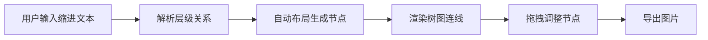

## 1. 产品概述
缩进文本树形流程图生成器，帮助用户快速将会议记录、大纲等缩进格式文本转换为可视化的树形流程图。
- 核心功能：粘贴缩进/列表文本 → 自动解析层级 → 生成可交互树图 → 导出图片
- 目标用户：需要快速制作流程图、思维导图、组织结构图的办公人群

## 2. 核心功能

### 2.1 功能模块
1. **文本输入区**：支持粘贴缩进文本、Markdown 列表、有序/无序列表
2. **树形图画布**：节点可拖拽、画布可缩放平移、自动布局
3. **导出功能**：支持 PNG 和 SVG 两种格式导出
4. **工具栏**：布局重置、缩放控制、导出按钮

### 2.2 页面详情
| 页面名称 | 模块名称 | 功能描述 |
|-----------|-------------|---------------------|
| 主页面 | 文本输入面板 | 左侧文本输入区域，实时解析预览 |
| 主页面 | 树形图画布 | 中央大面积画布，展示树形结构 |
| 主页面 | 工具栏 | 顶部操作栏，包含导出、布局重置等功能 |

## 3. 核心流程
用户在左侧输入带缩进的文本，系统实时解析层级关系，自动布局生成树形图。用户可拖拽调整节点位置，缩放平移画布，最后导出为 PNG 或 SVG 图片。

## 4. 用户界面设计

### 4.1 设计风格
- **主色调**：深靛蓝 (#1e1b4b) 作为主色，配合柔和的薄荷绿 (#10b981) 作为强调色
- **背景**：深色主题，带有细微网格纹理，营造专业工具感
- **节点样式**：圆角矩形，带有柔和阴影，不同层级使用不同深浅
- **字体**：使用 JetBrains Mono 作为代码/文本字体，现代感强
- **整体风格**：暗黑科技风，精致细腻，专注于内容本身

### 4.2 页面设计概述
| 页面名称 | 模块名称 | UI 元素 |
|-----------|-------------|-------------|
| 主页面 | 文本输入面板 | 深色代码编辑器风格，带行号，等宽字体 |
| 主页面 | 树形图画布 | 渐变背景，网格纹理，节点带光晕效果 |
| 主页面 | 工具栏 | 半透明玻璃拟态，图标按钮，悬停动效 |

### 4.3 响应性
- 桌面端优先，左右分栏布局
- 支持拖拽调整左右面板宽度
- 画布区域自适应剩余空间
