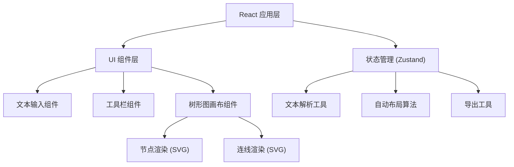

## 1. 架构设计
纯前端单页应用，使用 React + TypeScript + Vite 构建。树形图渲染使用原生 SVG 实现，确保高性能和导出能力。



## 2. 技术描述
- **前端**：React@18 + TypeScript + Vite
- **样式**：Tailwind CSS 3
- **状态管理**：Zustand
- **图标**：Lucide React
- **渲染方式**：原生 SVG 实现树形图（支持直接导出 SVG）
- **导出功能**：PNG 导出使用 html2canvas 或原生 SVG → Canvas 转换

## 3. 目录结构
```
src/
├── components/
│   ├── TextInput.tsx      # 文本输入组件
│   ├── Toolbar.tsx        # 工具栏组件
│   ├── TreeCanvas.tsx     # 树形图画布
│   ├── TreeNode.tsx       # 单个树节点
│   └── TreeLink.tsx       # 节点连线
├── hooks/
│   ├── usePanZoom.ts      # 画布平移缩放
│   └── useDragNode.ts     # 节点拖拽
├── utils/
│   ├── textParser.ts      # 缩进文本解析
│   ├── layout.ts          # 自动布局算法
│   └── export.ts          # 导出工具
├── store/
│   └── useTreeStore.ts    # 状态管理
├── types/
│   └── tree.ts            # 类型定义
├── App.tsx
└── main.tsx
```

## 4. 核心类型定义

```typescript
interface TreeNodeData {
  id: string;
  label: string;
  level: number;
  children: TreeNodeData[];
  parentId: string | null;
}

interface NodePosition {
  x: number;
  y: number;
  width: number;
  height: number;
}

interface TreeState {
  nodes: Map<string, TreeNodeData>;
  positions: Map<string, NodePosition>;
  rootId: string | null;
  scale: number;
  offset: { x: number; y: number };
  text: string;
}
```
